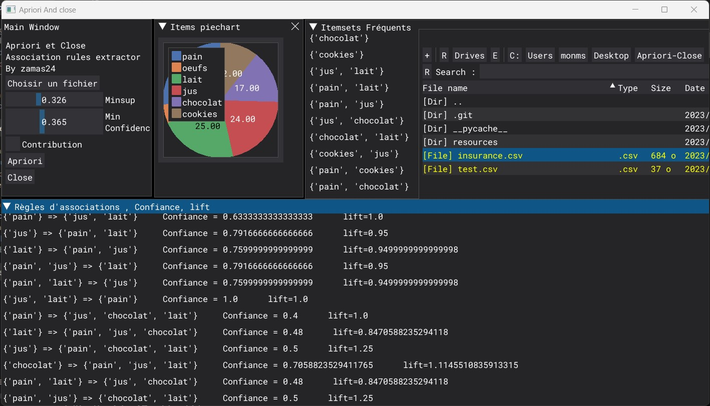

# Apriori-Close
An implementation of the Apriori and Close association rules mining Algorithms. With a beautiful dearpygui GUI.

## Structure of the code
The code is divided in two classes, one is the `App` class, which is all of the daerpygui items and the interactions of the user with callbacks. 
that uses the Algorithm class to call the apriori method or the close method to run the algorithms. 

## About the data file
The app suppors .csv files, and the format of your iterms should be arranged in a specific way.

> ### :warning: Warning
> You should respect the format of the the file, otherwise it won't work. 
> The file should contain only rows of transactions of different items. Without the description head

## About the contribution
In adition to implementing just the algorithms of Aprio and Close. I have added a contribution to the apriori algorithm, when it's checked it opperates as follow: 

* Initially, the algorithm finds `frequent item sets` based on the provided `minsup`

* Then, it resets the minimum support threshold to 0.10 and iterates while the number of frequent item sets (frequent_itemsets) is greater than **half of the total number of distinct items in the dataset** 

* Within the loop, it gradually increases the minimum support threshold by 0.05 in each iteration and recalculates the frequent item sets and association rules using the updated threshold.

* This process continues until the condition (len(frequent_itemsets) > len(Algorithm.get_item_counts(data).items())/2) is no longer met, ensuring that the algorithm extracts frequent item sets while considering their contribution to the dataset.
